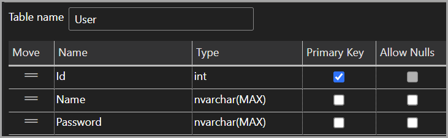
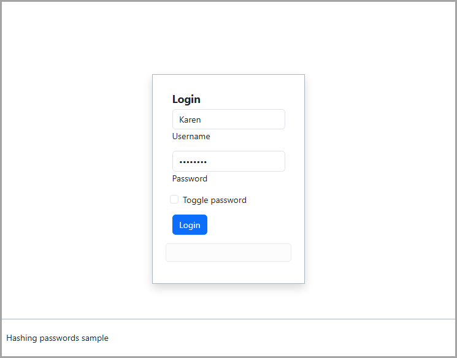

# About

For hashing passwords [article](https://dev.to/karenpayneoregon/storing-passwords-safely-c-ifh).

| Project name        |   Description    
|:------------- |:-------------|
| BCrypt.Net-Next |  |  
| AdminApplication | Used to create mocked users |  
| DapperSample | Dapper example |
| EF_Core_ValueConversionsEncryptProperty | Creates database |  
| HashingNoDatabaseApp | Password hashing no database |  
| RazorPagesSample | ASP.NET Core example |  
| Other |  |  
| GeneratePasswordApp | Example to get random/secure passwords |  
| NetDevPackHasherArgonApp | Uses NetDevPack.Security.PasswordHasher.Argon2 NuGet package  |  

